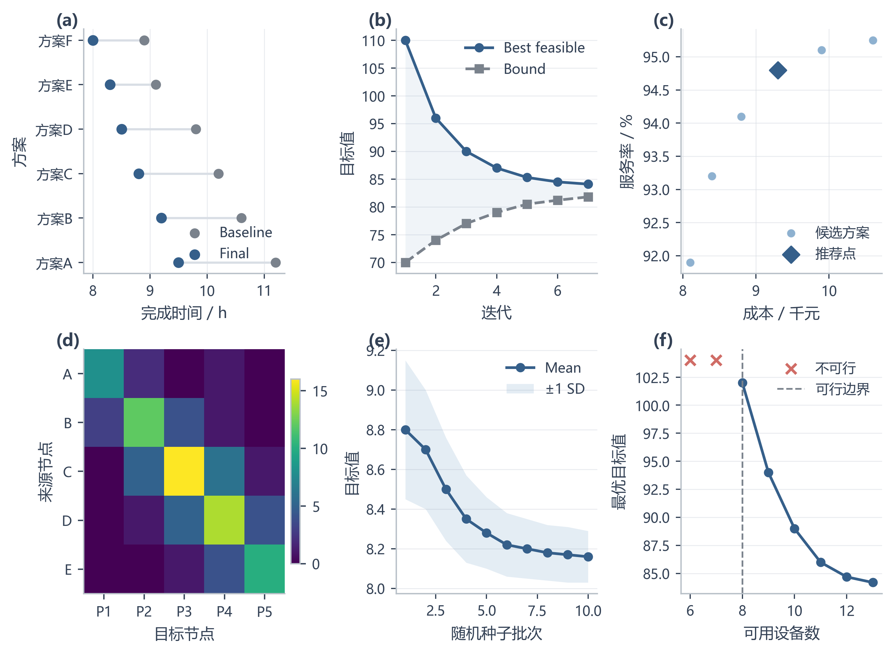
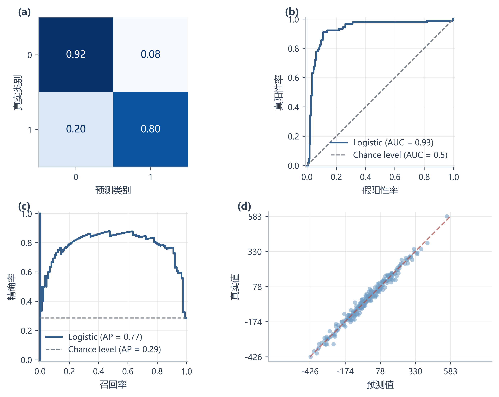

# 数学建模工作流 V4.6

一个可直接安装的 Agent Skill，覆盖数学建模竞赛从读题、数据取证、模型选择、求解与验证，到论文叙事、出版级绘图、LaTeX 排版和提交审计的完整生命周期。

它解决的不是“帮我选一个算法”，而是把建模过程变成可追踪、可验证、可复现的工程流程：先证明问题适合建模，再决定模型；先建立质量契约，再冻结结果；论文中的每个结论都能回到数据、代码或实验记录。

## 效果展示

### 出版级数学建模图表



### scikit-learn 诊断图



仓库同时提供 SVG、彩色 PNG、灰度 PNG 和 PDF 版本，便于论文插图、打印检查和答辩展示。

## 适用场景

- 全国大学生数学建模竞赛及校赛训练。
- 预测、统计推断、运筹优化、动态 / 随机决策等题型。
- 需要从原始附件构建可审计数据链路的项目。
- 需要验证模型边界、稳定性、泛化性或求解质量的项目。
- 需要把结果整理成高质量论文、图表和答辩材料的项目。

## 工作流总览

| 阶段 | 目标 | 典型产物 |
| --- | --- | --- |
| M0 项目控制 | 明确问题、约束、交付标准和角色分工 | 问题清单、计划、风险与状态交接 |
| M1 数据与基准 | 审计附件、字段、缺失值、异常与基线 | 数据字典、发现台账、基准结果 |
| M2 模型设计 | 通过 Modeling Eligibility Gate 后选择模型 | 假设、变量、目标、约束、评价指标 |
| M3 求解与优化 | 实现算法并记录求解边界 | 代码、结果、Bound / Gap / Solver Certificate |
| M4 验证与实验 | 独立验证、消融、敏感性与外部检验 | 验证报告、稳定性结论、反例 |
| M5 论文工程 | 把证据组织成可读的论证链 | Narrative Spine、段落卡、证据故事板 |
| M6 可视化与提交 | 统一图表语义并完成排版审计 | PDF / SVG 图、LaTeX、提交检查表 |
| M7 答辩与评审 | 从评委视角检查可信度与表达 | 质询清单、答辩重点、最终冻结记录 |

题型分支覆盖：

- B1：预测与统计推断
- B2：预测到决策
- B3：动态与随机决策
- B4：反事实与外部验证
- B5：运筹与组合优化

## 安装

### 方式一：克隆到 Skill 目录

```bash
git clone https://github.com/xingchenyd/mathematical-modeling-workflow.git \
  ~/.agents/skills/mathematical-modeling-workflow
```

目录名必须保持 `mathematical-modeling-workflow`，以匹配 [`SKILL.md`](./SKILL.md) 中的 `name`。

### 方式二：手动安装

下载仓库后，将整个目录放入你的 Agent Skills 目录。Codex、Claude Code 等支持 Agent Skills 的运行时会根据 `SKILL.md` 自动判断何时加载。

更完整的安装与兼容说明见 [`INSTALL.md`](./INSTALL.md)。

## 使用示例

最简单的指令：

```text
使用 mathematical-modeling-workflow skill 完成这次数学建模任务。
先读取全部题目和附件，执行 M0、M1；不要直接选算法。
Modeling Eligibility Gate 通过后再进入建模与求解，
并用独立 Validator 和 Solution Quality Contract 决定是否冻结结果。
```

更聚焦的调用方式：

```text
请使用 mathematical-modeling-workflow 审查这份建模论文。
重点检查数据口径、模型适用性、求解质量、外部验证、图表表达和 LaTeX 提交规范。
```

```text
请使用 mathematical-modeling-workflow 为这道运筹优化题建立 M0-M4 工作区，
输出变量与约束表、可行性边界、求解器证书和敏感性实验计划。
```

## 可视化工具

安装可选绘图依赖：

```bash
python -m pip install -r requirements-visual.txt
```

生成示例图集：

```bash
python scripts/build_visual_gallery.py
python scripts/build_sklearn_gallery.py
```

在提交前执行图表检查：

```bash
python scripts/visual_lint.py examples/publication_visual_gallery.png
```

绘图入口包括：

- [`scripts/paper_plot_style.py`](./scripts/paper_plot_style.py)：论文图表主题与导出规则。
- [`scripts/sklearn_paper_display.py`](./scripts/sklearn_paper_display.py)：scikit-learn 诊断图适配器。
- [`assets/styles/modeling-paper.mplstyle`](./assets/styles/modeling-paper.mplstyle)：Matplotlib 样式表。

## 可视化原则

“漂亮”不等于高饱和或复杂装饰。最终图必须做到图型正确、语义明确、配色一致、感知可靠、灰度可读并且不会误导。

- 最终图优先输出 PDF / SVG；位图建议至少 300–400 dpi。
- 连续数值优先使用 `viridis` / `cividis` 等感知均匀色图。
- 只有存在真实中心（例如 0 或基准差值）时才使用发散色图。
- 每张图都应包含单位、图例、来源 / 口径和一句明确结论。
- 同时检查彩色版与灰度版，避免信息只依赖颜色区分。

## 目录结构

```text
mathematical-modeling-workflow/
├── SKILL.md                         # Skill 入口与路由规则
├── references/                      # M0-M7 与 B1-B5 方法库
├── assets/
│   ├── styles/                      # 绘图样式
│   └── templates/                   # 台账、契约与审计模板
├── scripts/                         # 结构验证、绘图、图表检查
├── examples/                        # 彩色 / 灰度 / 矢量示例图
├── tests/                           # 结构、绘图和压力测试
├── VERIFICATION_REPORT_V4.6.md      # 当前版本验证报告
└── 数学建模工作流_V4.6_合并阅读版.md # 便于连续阅读的合并版
```

## 验证

```bash
python scripts/validate_skill.py
python -m pytest tests
```

压力测试和回归场景见 [`tests/pressure_tests.md`](./tests/pressure_tests.md)，当前版本的完整验证记录见 [`VERIFICATION_REPORT_V4.6.md`](./VERIFICATION_REPORT_V4.6.md)。

## 版本与贡献

- 当前版本：[`VERSION`](./VERSION)
- 变更记录：[`CHANGELOG.md`](./CHANGELOG.md)
- 贡献指南：[`CONTRIBUTING.md`](./CONTRIBUTING.md)
- 引用方式：[`CITATION.md`](./CITATION.md)
- 许可证：[`LICENSE`](./LICENSE)
